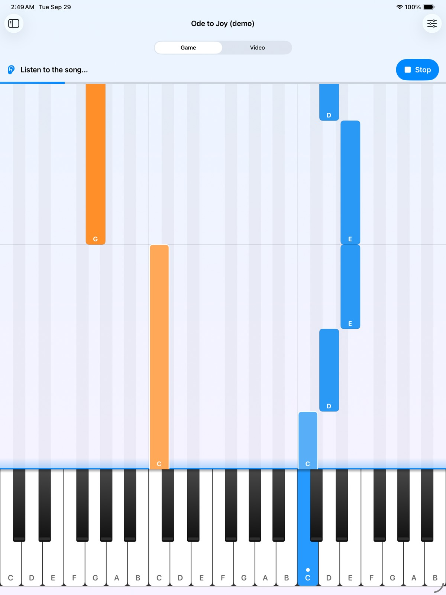
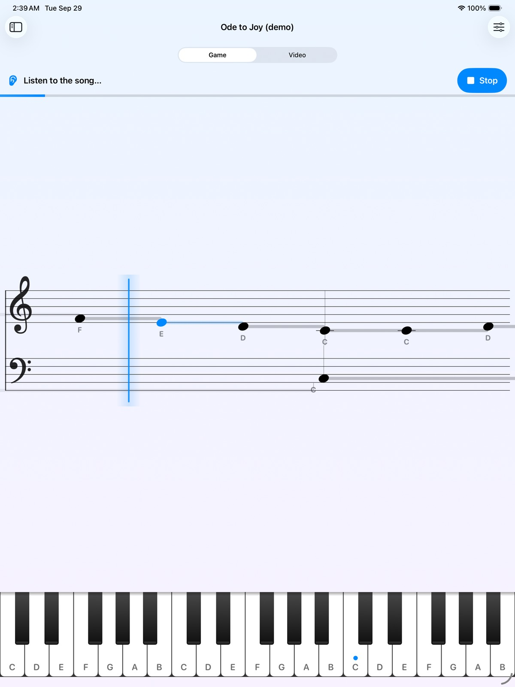
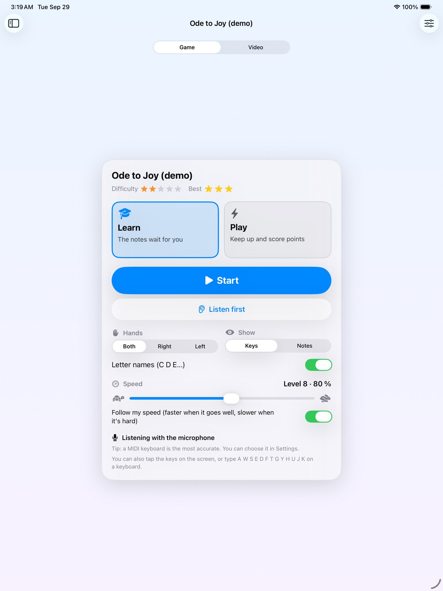
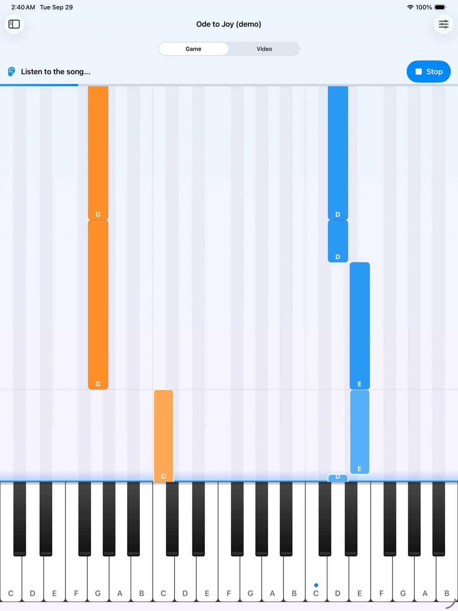
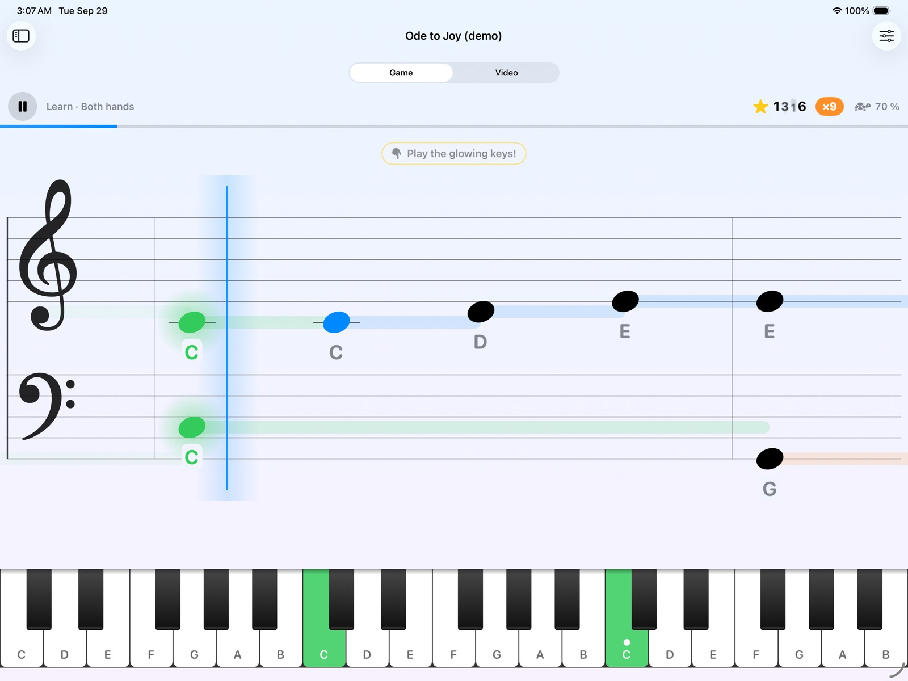
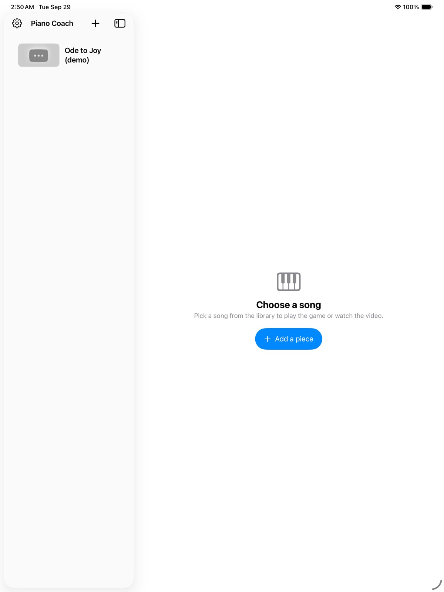
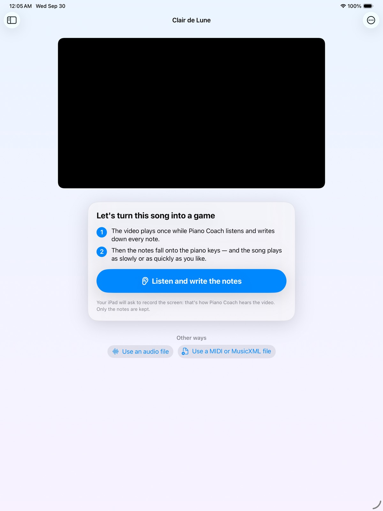

# Piano Coach

An iPhone, iPad and Mac app that helps a child learn piano from YouTube songs.

## How it works for your child

1. **Give it a YouTube link.** Paste the link of a piano song (a tutorial, a performance…).
2. **It listens once.** Press *Listen and write the notes*: the video plays once while Piano Coach
   records its sound and writes down every note with an on-device transcription model
   ([Basic Pitch](https://github.com/spotify/basic-pitch) by Spotify). It works out the tempo, the
   key (e.g. *G major*) and which hand plays each note.
3. **From then on it's the app's own piano.** The song becomes notes, not a recording, so it can be
   played **as slowly or as quickly as needed without losing any quality** — no stretched,
   warbly audio — and the video isn't needed any more. The notes are saved as a MIDI file you can
   share.

## The game

Each song becomes a **falling-notes game**, like Guitar Hero or Synthesia but for a real piano.
Notes fall onto a full **88-key** keyboard; when the song starts, the view zooms in on the part of
the keyboard the song uses and follows the music up and down (a small strip above shows where you
are on the whole piano). When the child plays the right note, the key lights up **green**; a wrong
note lights **red**.

- **Watch and listen.** The app plays the song with its piano while the keys light up. Pause it,
  slow it down or speed it up at any time — then follow along.
- **Versions.** *Everything*, *Easier* (one note at a time in each hand) or *Just the tune*.
- **Two views.** *Keys* shows the falling notes and the keyboard labelled with letter names
  (C, D, E…). *Notes* shows a scrolling music staff to learn reading notes; each note lights up as
  it's played. Letter names can be turned off.
- **Two modes.** *Learn*: each note waits at the line until it's played. *Play*: the notes keep
  falling and the child scores points and combos for playing on time.
- **The speed adapts to the child.** If they play slowly, make the notes wait or miss, the game
  slows down. When they play accurately and on time, it speeds up a little.
- **Levels.** Each song remembers its level (its starting speed). A great game (3 stars) moves
  the next game up 10 %; a hard one moves it back down. The library shows each song's difficulty,
  level and best stars.
- **Practise one hand.** Choose right or left hand; the app can play the other hand along.
- **Voice commands.** "Play", "stop", "slower", "faster" — see *Things to say*.
- **Input.** The device's microphone listens to any piano; a USB/Bluetooth MIDI keyboard gives
  exact notes. The on-screen keyboard can be tapped too (and on a Mac the keys A W S E D F T G Y H
  U J K play C4–C5), which is handy for trying the game without a piano.

### Where the notes come from

- **The video (automatic).** Piano Coach records the sound the device is playing: on iPad and
  iPhone with ReplayKit (the system asks once to allow recording the screen — only the sound is
  used, and only the notes are kept); on a Mac with ScreenCaptureKit (the Mac asks for *Screen &
  System Audio Recording* permission, and other sounds playing at the same time are heard too). If
  that isn't allowed, it listens to the video through the microphone instead.
- **An audio file.** *Learn from an audio file…* reads an MP3, M4A, WAV… of the song — faster than
  real time, and the cleanest source if you have one.
- **Sheet music (exact).** *Use a MIDI or MusicXML file…* takes the notes straight from the file
  (MuseScore and many tutorial channels offer them).

Transcription is very good on clear solo piano and simpler pieces, and makes some mistakes on
dense or fast music, pedalled chords and recordings with other instruments.

### Screenshots (iPad)

Captured automatically on an iPad Pro simulator by the CI build (`-screenshot-demo`, built-in
demo song played by a simulated child):

| Keys view | Notes view |
|---|---|
|  |  |

| Start screen | Landscape |
|---|---|
|  |  |

| Notes in landscape | Library |
|---|---|
|  |  |

| Learning a new song |
|---|
|  |

## Build and run

Requirements: a Mac with **Xcode 16 or newer** (Xcode 26 recommended). Targets iOS/iPadOS 17+
and macOS 14+.

1. Open `PianoCoach.xcodeproj`.
2. Select the **PianoCoach** target → *Signing & Capabilities* → choose your **Team** (a free
   Apple ID "Personal Team" works for your own devices). If Xcode complains that the bundle
   identifier is taken, change `com.farhatnadim.PianoCoach` to something unique.
3. Pick a destination (**My Mac**, an iPad/iPhone connected by cable, or a simulator) and press **Run**.
   - On an iPhone/iPad the first run asks you to trust the developer profile:
     *Settings → General → VPN & Device Management*.
   - The iOS Simulator uses your Mac's microphone.
   - YouTube needs an internet connection.

If you prefer generating the project, `project.yml` describes the same project for
[XcodeGen](https://github.com/yonaskolb/XcodeGen) (`brew install xcodegen && xcodegen`).

## First practice session

1. **+** → paste a YouTube link (the title is filled in automatically).
2. Open the song and press **Listen and write the notes**. Let the video play to the end (or stop
   early to use what was heard). Writing the notes down takes a few seconds.
3. Press **Watch and listen** to hear the song on the app's piano, then pick *Learn* or *Play*, a
   version, a hand, *Keys* or *Notes*, and press **Start**.

No video handy? Open any song, choose **Song → Use a MIDI or MusicXML file…** and pick
`Samples/Ode to Joy (easy).musicxml`.

## Things to say

| Playing | Speed | What you see |
|---|---|---|
| play / start / keep going | slower / slow down / reduce speed | show the notes |
| stop / pause / wait | faster / speed up / increase speed | show the keys |
| again / from the top | normal speed | right hand / left hand / both hands |
| listen / play the song | half speed / speed 75 | sound on / sound off |
| | | what can I say |

In a noisy room, turn on *Settings → Only after "Coach"* and start commands with "Coach"
("Coach, slower").

## Tips

- **A MIDI keyboard is the most reliable input.** A digital piano connected by USB (iPad: USB-C or
  a Lightning camera adapter) or Bluetooth MIDI gives the exact notes.
- With the microphone, *Echo cancellation* (Settings) stops the app's own piano from being heard as
  your child's notes when the app plays along.
- If the game misses soft notes, raise *Sensitivity*. If it reacts to noise, lower it.
- If a learned song has mistakes, try *Learn from an audio file…* with a clean recording, or a MIDI
  file.

## How it works

```
YouTube video ─► app sound (ReplayKit / ScreenCaptureKit, or the microphone)
audio file ────┘        │
                        ▼
            22.05 kHz mono ─► Basic Pitch (Core ML) ─► notes ─► song arranger ─► MIDI file
                                                   (pitch, start, end,  (clean-up, tempo, key,
                                                    loudness)            hands, measures)
MIDI file / MusicXML ─────────────────────────────────────────────────────────────┘
                                                                          │
                                        ┌─────────────────────────────────┘
                                        ▼
                     game: falling notes on 88 keys, staff, Watch (recorded piano), Learn, Play
                                        ▲
                     microphone (onset detector) or MIDI keyboard — the child's playing
```

- **Recording the video's sound.** On iPad and iPhone, ReplayKit's in-app capture delivers the
  app's own audio (the YouTube player's sound) as sample buffers; on the Mac, ScreenCaptureKit
  records the system's sound. The raw PCM (often big-endian 16-bit) is decoded to mono floats and
  kept until the video ends (at most 12 minutes). If the recording stays silent while the video
  plays, the app switches to the microphone and starts the video again.
- **Writing the notes down.** The audio is resampled to 22.05 kHz and cut into overlapping 2-second
  windows for Spotify's Basic Pitch model (a small Core ML network, ~270 KB) that estimates, for
  every 11.6 ms frame and each of the 88 keys, how likely a note is sounding and starting. The
  decoding that turns those activations into notes is a Swift port of Basic Pitch's own
  (`BasicPitch`, `BasicPitchDecoder`) and gives exactly the same notes as the Python reference.
- **Arranging.** `SongArranger` removes weak notes, fragments and harmonic "ghost" notes, estimates
  the tempo and beat, the key (Krumhansl–Kessler profiles) and the metre, assigns each note to a
  hand (following where each hand is on the keyboard), and builds measures. Times map linearly
  to beats, so at 100 % the rendition keeps the original timing. The result is saved as a
  standard MIDI file (right and left hand tracks, tempo, key signature).
- **Renditions.** The game plays the notes with a recorded grand piano (one sample per key,
  re-pitched between recordings), so any speed sounds natural. *Easier* keeps the top note of the
  right hand and the lowest of the left; *Just the tune* keeps only the right hand's top line.
- **The game** (`GameEngine`): a playhead moves through the song's notes at the chosen speed.
  In *Learn* mode it stops at each chord until every required note is played. In *Play* mode,
  notes played within 0.1 s are *perfect*, within 0.25 s *good*, and later ones are *missed*.
  Every chord gives a "struggle" score (waiting long, playing late, missing or wrong notes count
  up; quick and on-time count down). When the last 8 chords average clearly high the speed drops
  15 %; when clearly low it rises 8 %.
- **Hearing the child.** With the microphone, a log-spectral-flux onset detector finds each attack
  and measures the pitch content right after it (with the energy that was already sounding
  subtracted), which is matched to the expected chord. A MIDI keyboard gives exact notes.
- **One audio engine.** The microphone (notes and voice commands) and the app's piano share one
  AVAudioEngine, so starting one never silences the other, and with echo cancellation on, the
  app's own piano is removed from what the microphone hears.
- **Voice commands** use Apple's speech recogniser (on-device when available) on the same
  microphone stream, biased towards the command phrases.

The engine is the Swift package in `Packages/PianoCoachCore`. It uses Foundation only (plus Core ML
and AVFoundation for the model and the piano recordings on Apple platforms) and has more than 250
unit tests. Run them with:

```sh
cd Packages/PianoCoachCore && swift test
```

On a Mac this includes an end-to-end test that plays a song on the recorded piano, transcribes it
with the Core ML model and checks the notes, key and tempo.

## Limitations and notes

- **Transcription isn't perfect.** Clear solo piano works best. Very fast passages, heavy pedal,
  singing or other instruments lead to missing or extra notes; a MIDI or MusicXML file gives exact
  notes when you have one.
- **Only videos whose owners allow embedding** can play in the app (otherwise YouTube reports
  error 101/150). Ads may play before some videos and are recorded too — let them finish or stop
  early and learn again.
- Recording the video's sound is for your family's own practice. YouTube's terms don't allow
  apps on the App Store to extract audio from videos, so this app is meant to be built and run
  from Xcode, not published.
- The learned tempo is one steady tempo: if the pianist speeds up or slows down a lot, bar lines
  drift, but the notes keep their original timing.
- Everything runs on the device. Speech recognition uses on-device recognition when available.

## Project layout

```
PianoCoach.xcodeproj         Xcode project (one multiplatform target)
PianoCoach/                  App sources (SwiftUI, WebKit, AVFoundation, ReplayKit/ScreenCaptureKit,
  App/  Audio/  Game/          Core ML, Speech, CoreMIDI)
  Player/  Speech/  Views/
  Models/                    BasicPitchNMP.mlpackage (Spotify Basic Pitch, Apache 2.0)
  PianoSamples/              Recorded grand piano, one MP3 per key (Fluid R3, CC BY 3.0)
WebAssets/                   YouTube player page
Packages/PianoCoachCore/     Pure-Swift engine + tests
Samples/                     Sample MusicXML
ThirdParty/                  Third-party licenses
```
